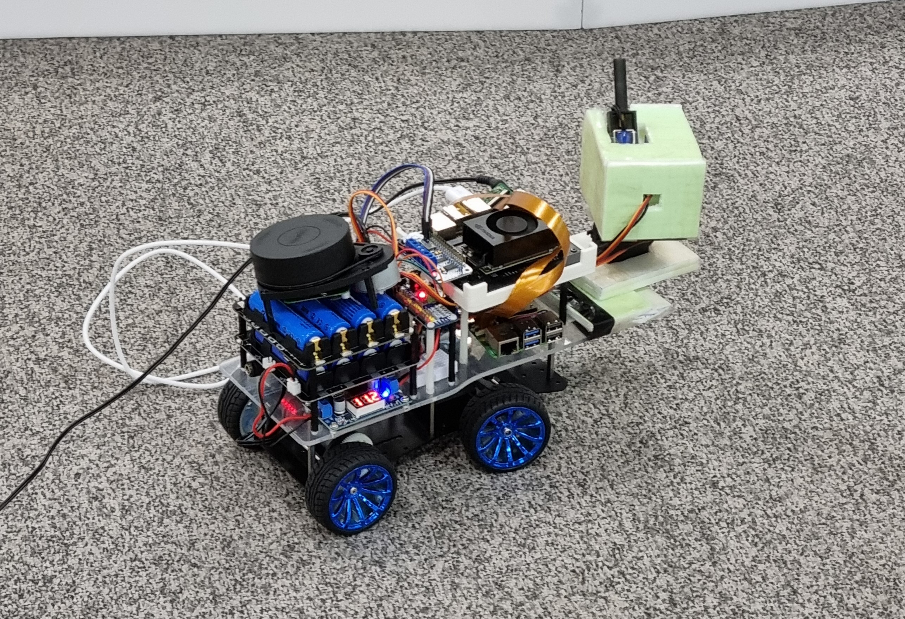
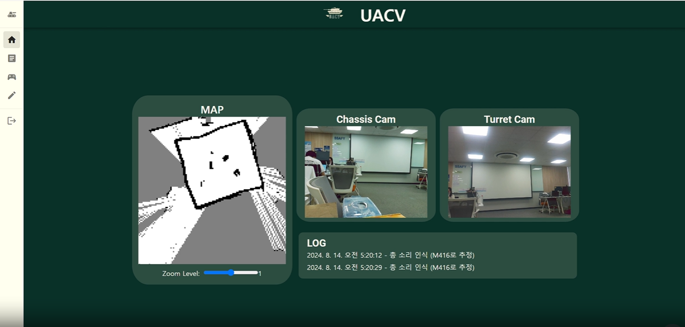
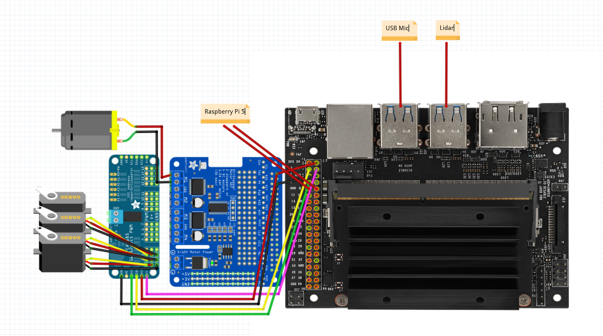
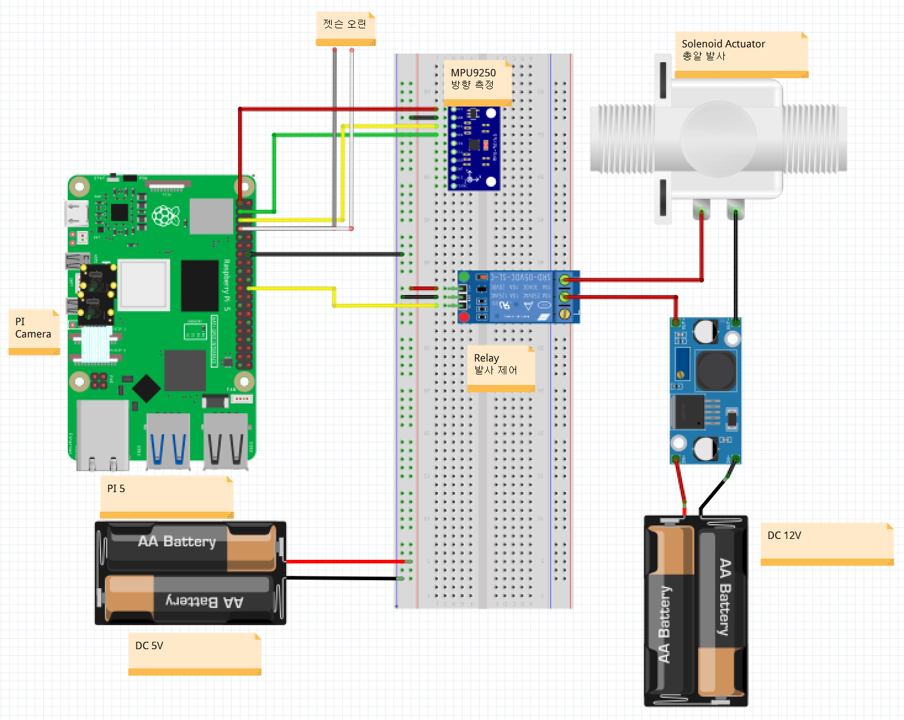
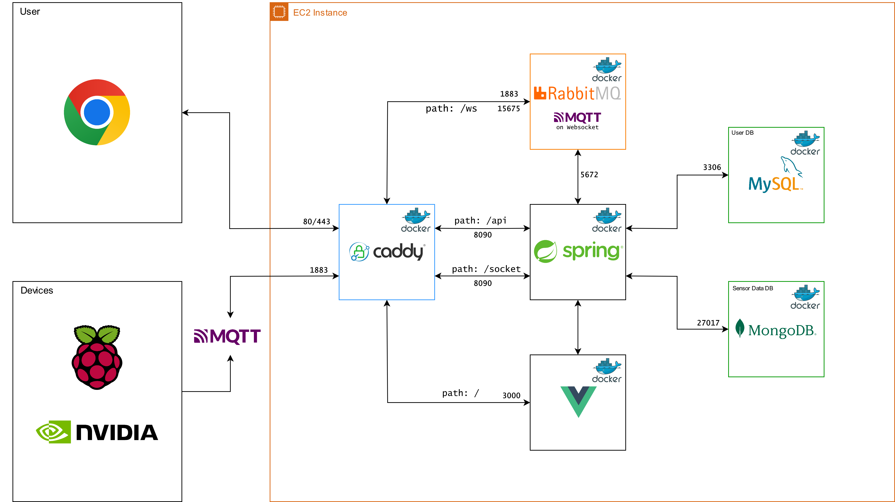
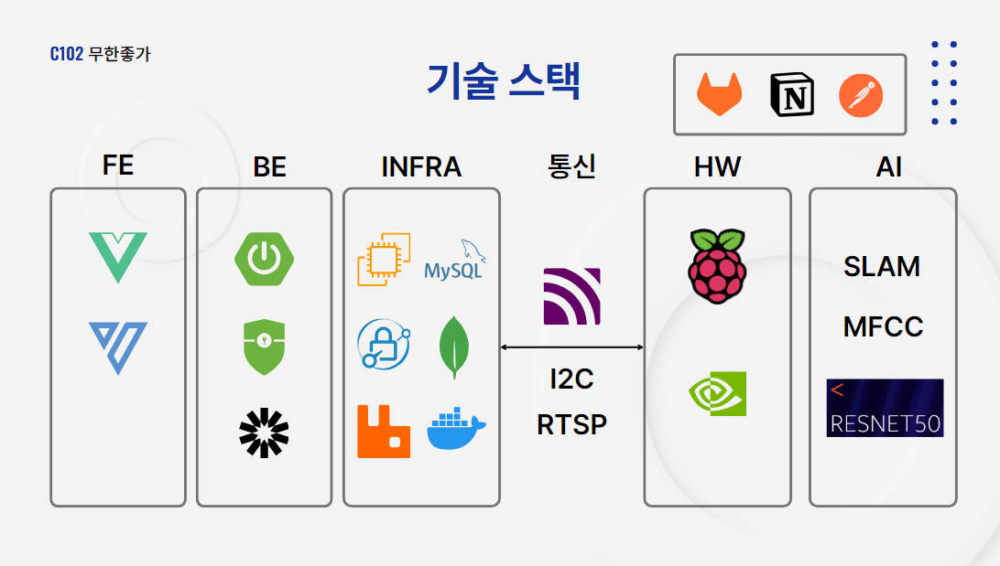
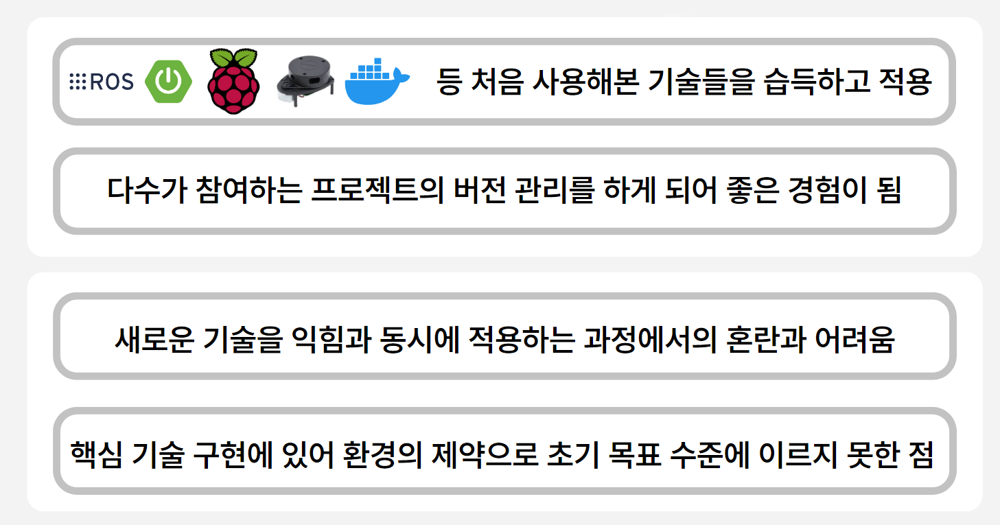

## 프로젝트명

#### UACV (ULTRA AUTONOMOUS COMBAT VEHICLE)

라즈베리파이, 젯슨오린나노 Sensing Data를 활용한 자율 전투차 제작

## 기간 / 인원

2024.07.08 ~ 2024.08.16 (6주),  6명

이정하 : 팀장, FE, BE

송준혁 : 서버, 인프라, BE

이채연 : FE, BE

조정훈 : PM, Pi5,전장 및 제어

김채민 : 젯슨 오린 나노, 서기

문준석 : 자율주행, 총기 분류 모델

## 개       요

병력 자원 감소와 인명 피해 감소를 위한 무인 자율 전투 차량 제작

## 기술 / 환경

#### 기술1 - 자율주행
LiDAR SLAM 기반 MAPPING 자율 주행

SLAM: 동시적 위치추정 및 지도작성

센서1: LiDAR 
레이저를 발사하고 레이저가 물체에 반사되어 돌아오기까지의 시간을 측정하여 거리를 추정

센서2: IMU센서 이용
가속도 센서, 각속도 센서, 지자기 센서로 로봇의 방향과 기울어짐 등의 자세 파악

Navigation : ROS, cost map을 이용하여 지도 내에서 목표점을 입력받은 뒤, 목적지까지의 경로를 따라 이동하도록 명령

#### 기술2 - 소리 분석
MFCC 기반 모델로 총기 소리를 판단

음성 데이터를 mel-spectogram으로 변환하여 이미지화 한 뒤, 증강을 거쳐 resnet 기반 커스텀 모델에 학습

#### 기술3 - 사격
표적 조준 및 포격

서보모터 제어 기반으로 조준 후 솔레노이드가 탄환을 밀어내면서 발사

#### 기술4 - 원격 모니터링 및 제어
대시보드 에서 모니터링 및 컨트롤 페이지에서 제어

로그, 원격주행, 정보수정 세부 페이지 제작

## Nvidia Jetson Orin Nano 회로도

## Raspberry Pi 5 HW결선

## 구현   사항
### 통신 개요도

### 아키텍처 구조도

## 기술   스택

## 프로젝트 고찰

