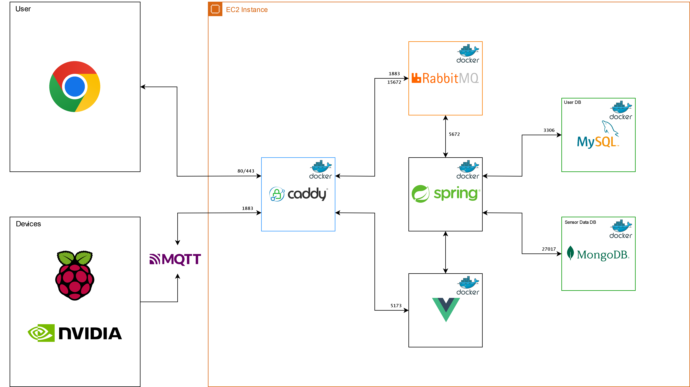

## 프로젝트명

#### UACV (ULTRA AUTONOMOUS COMBAT VEHICLE)

라즈베리파이, 젯슨오린나노 Sensing Data를 활용한 자율 전투차 제작

## 기간 / 인원

2024.07.08 ~ 2024.08.16 (6주),  6명

이정하, 송준혁, 이채연, 조정훈, 김채민, 문준석

## 개       요

병력 자원 감소와 인명 피해 감소를 위한 무인 자율 전투 차량 제작

## 기술 / 환경

#### 기술1 - 자율주행
LIDAR SLAM 기반 MAPPING 자율 주행

#### 기술2 - 소리 분석
MFCC 기반 모델로 총기 소리를 판단

#### 기술3 - 사격
표적 조준 및 포격

#### 기술4 - 원격 모니터링 및 제어
대시보드 에서 모니터링 및 컨트롤 페이지에서 제어

## Nvidia Jetson Orin Nano 회로도

## Raspberry Pi 5 HW결선

## 구현   사항
### 통신 개요도

### 아키텍처 구조도

## 기술   스택

