# 시연 시나리오

### 1. 매핑
    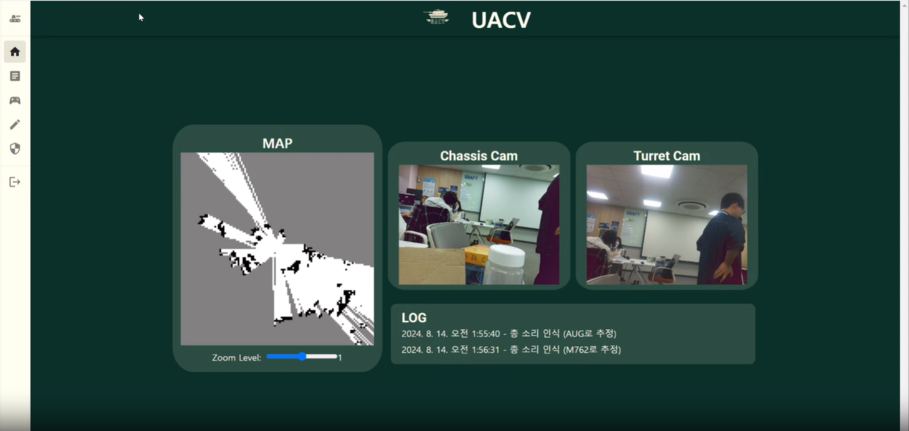
    - 라이다와 SLAM으로 실시간 주변 지형 매핑
    - 지도 확대 축소 가능

### 2. 자율주행+원격 조종
    - 매핑 지도 아래에 좌표를 입력하면 , 해당 위치로 자율주행
    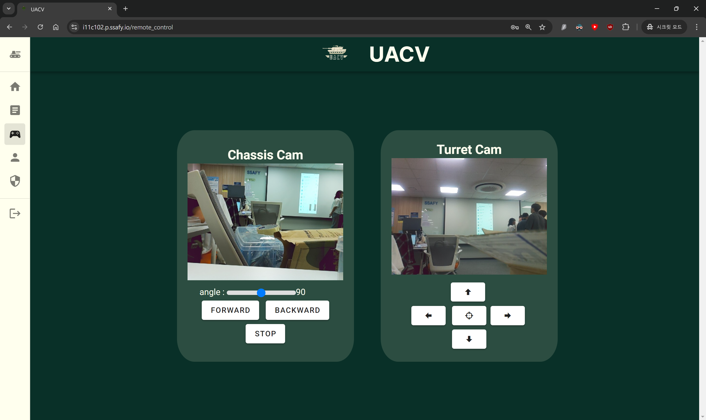
    - 원격 조종 페이지에서 차의 방향, 전/후진, 정지 가능
    - 원격 조종 페이지에서 포신의 좌우 각도, 상하 각도 조절 및 발포 가능
    
### 3. 포격
    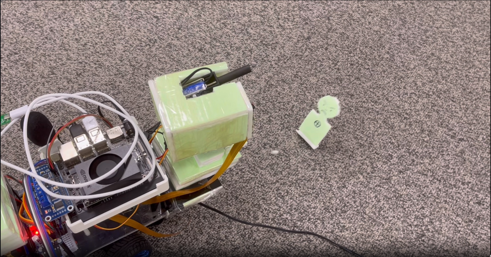
    - 원격 조종 페이지에서 보이는 카메라 화면으로 조준 가능
    - 원격 조종 페이지에서 조종 및 발포 가능

### 4. 소리
    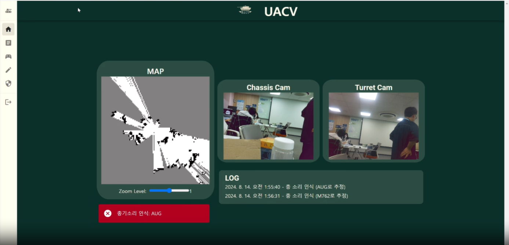
    - 마이크에 총소리가 들어가면, 젯슨 오린 나노 보드에서 소리를 판단해서 정확도 80% 이상인 경우에만 웹으로 전송
    - 웹소켓으로 정보를 받으면 비동기로 즉시 알림 배너가 3초간 뜸
    - 로그 컴포넌트의 리스트도 비동기로 갱신 됨

### 5. 대시보드 + 관리자
    - 대시보드에서는 실시간으로 전송되는 카메라 영상, 매핑 지도, 로그 확인 가능
    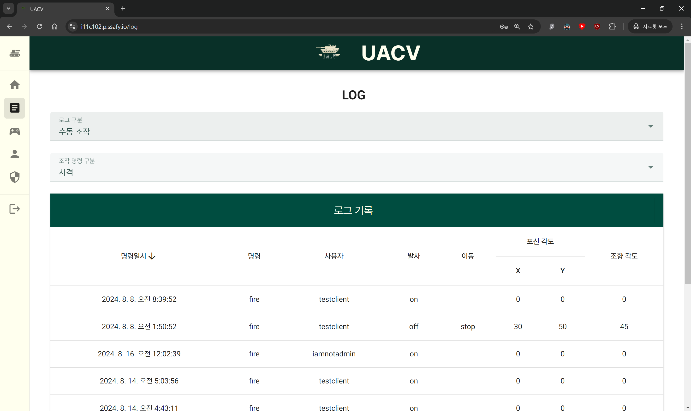
    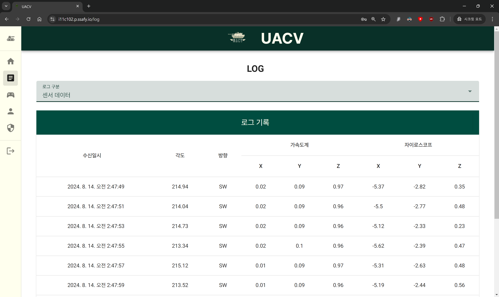
    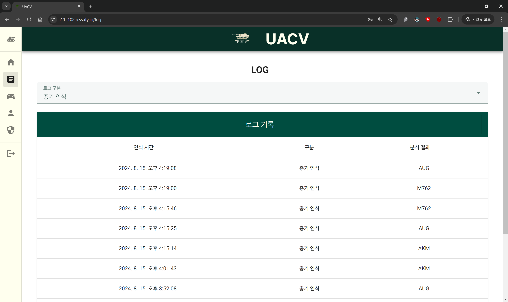
    - 사용자는 로그 페이지에서 분류별 로그 확인 가능
    - 관리자는 로그 뿐 아니라, 사용자 관리도 가능
        - 관리자는 하위 사용자 계정 생성 및 권한(모니터링 권한, 제어 권한) 부여, 사용자 계정 삭제 가능
    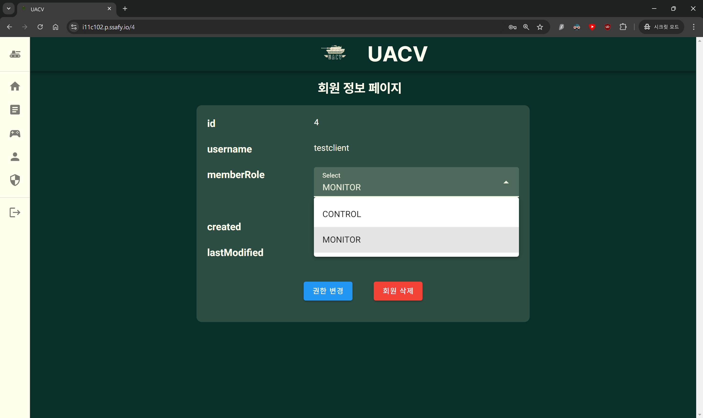
    - 계정 정보 페이지에서 본인 정보 수정 가능

### 6. 기타 웹 기능
    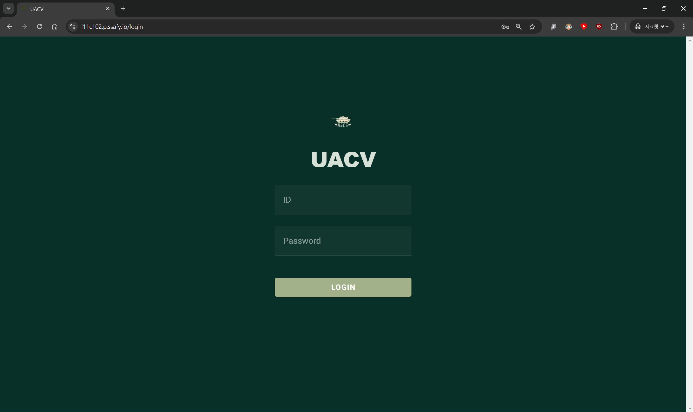
    - 로그인 및 로그인 실패 시 알림
    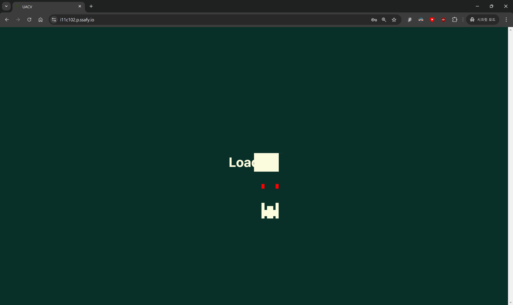
    - 로그인 후 대시보드로 넘어가기 전 기기 연결 될 때까지 약 2초간 로딩 페이지 등장
    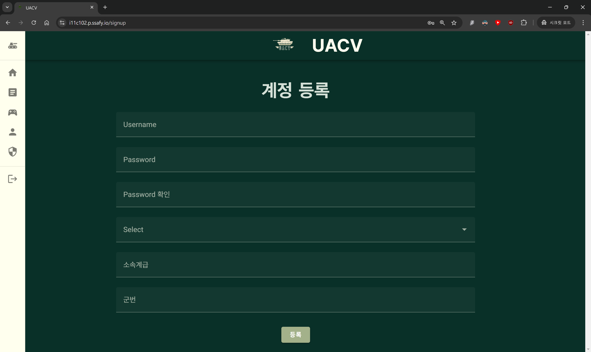
    - 일상적인 상황에서 사용하는 제품이 아니라, 전시 상황 등 군이나 유사 단체에서 쓸 것을 가정하여, 사용할 관리자 계정 등록은 최초에만 나타나고 관리자 계정 등록 이후로는 해당 서버에서 로그인만 가능
    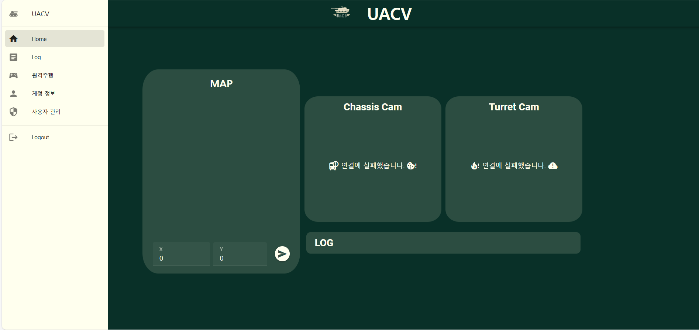
    - 네비게이션 바에 마우스를 올리면 열림